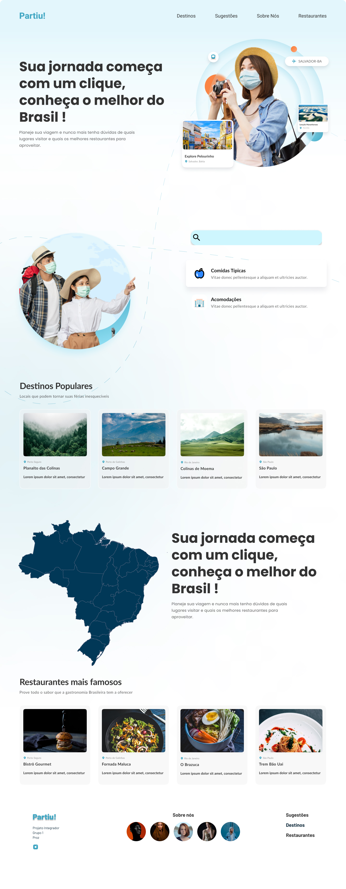
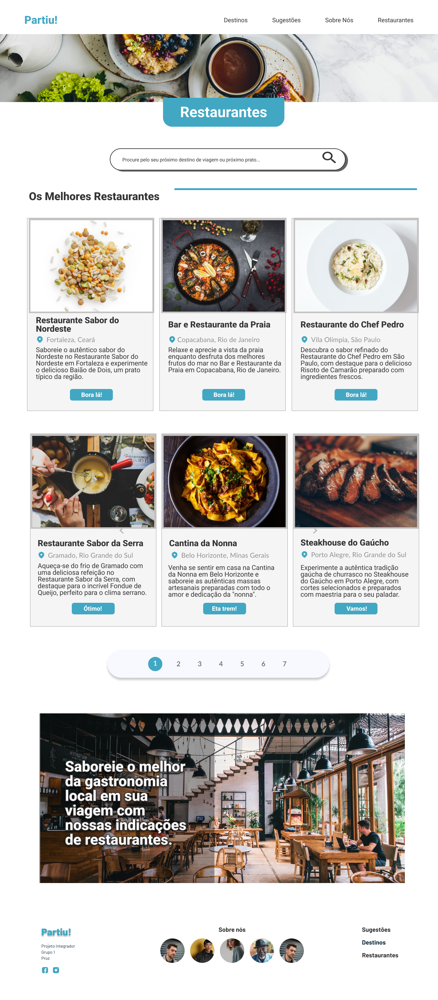
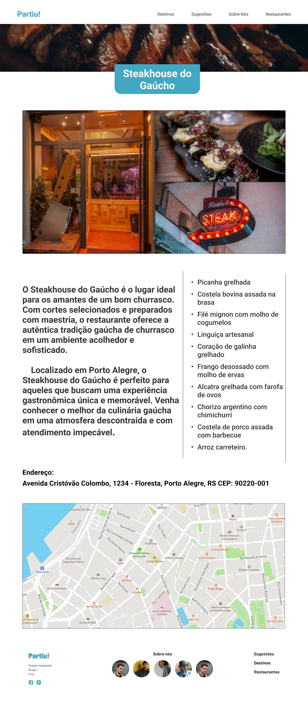

<h1 align = "center">  ✈ Projeto Integrador da turma 7A da Proz - Grupo 1 🧳
</h1>

Olá, somos o grupo 1 e este repositório apresentamos o site do nosso projeto, que tem o nome de Partiu!. O site foi concebido visando oferecer indicações de pontos turísticos
para pessoas que queiram descobrir novos lugares para viajar e também temos indicações de restaurantes onde os viajantes podem degustar o melhor da culinária
ao redor do Brasil!

## Membros da equipe

- Erick Carlos Lopes Santana Braga

  &nbsp;&nbsp;
  &nbsp;&nbsp;

- Jéssica Almeida

  &nbsp;&nbsp;
  &nbsp;&nbsp;

- Karen Carvalho

  &nbsp;&nbsp;
  &nbsp;&nbsp;

- Edna Carvalho

  &nbsp;&nbsp;
  &nbsp;&nbsp;

- Lucas Rodrigues

  &nbsp;&nbsp;
  &nbsp;&nbsp;

 

## Design do Projeto

### Home

### Restaurantes

### Restaurante

### Pontos Turisticos

### Ponto Turistico

### Sugestões

### Pesquisa

### Sobre Nós

