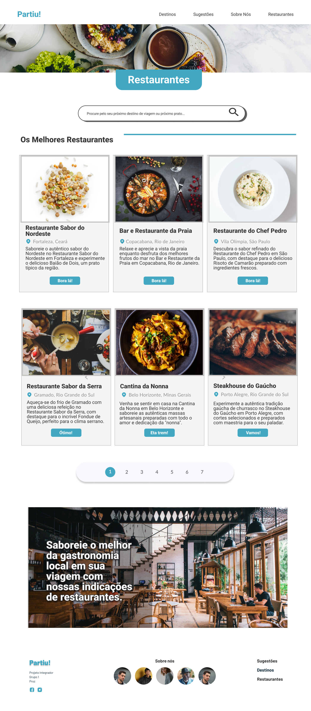
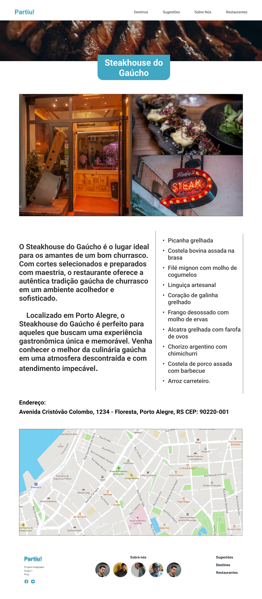

<h1 align="center">✈️ Partiu! — Guia de Turismo & Gastronomia Brasileira 🧳</h1>

<p align="center">
  <strong>Descubra destinos turísticos inesquecíveis e o melhor da gastronomia regional brasileira em uma plataforma web interativa, leve e dinâmica.</strong>
</p>

<p align="center">
  <a href="https://website-turismo-proz.vercel.app/"></a>
  
  
  
  
  
  
</p>

---

## 🔗 Link de Deploy / Acesso ao Vivo

Acesse a aplicação em produção hospedada na Vercel:

🌐 **[https://website-turismo-proz.vercel.app/](https://website-turismo-proz.vercel.app/)**

---

## 📖 Visão Geral

O **Partiu!** é uma plataforma web criada para facilitar o planejamento de viagens e experiências gastronômicas no Brasil. O projeto atende pessoas que desejam descobrir pontos turísticos em capitais e cidades históricas brasileiras, além de conhecer restaurantes conceituados que representam a diversidade culinária de cada região.

Concebido como **Projeto Integrador acadêmico (Turma 7A da Proz Educação - Grupo 1)**, o desafio central foi construir uma aplicação rica em funcionalidades interativas (busca, paginação, páginas dinâmicas e validação de formulários) utilizando exclusivamente as **tecnologias fundamentais da web (HTML5, CSS3 e JavaScript puro)**, sem frameworks pesados de frontend ou camadas tradicionais de banco de dados no backend.

---

## ✨ Funcionalidades

- 🔍 **Busca Multi-Critério em Tempo Real:** Motor de pesquisa capaz de filtrar simultaneamente cidades, nomes de locais, pontos turísticos, nomes de restaurantes e especialidades gastronômicas.
- 📍 **Catálogo de Destinos Turísticos:** Listagem paginada de cidades brasileiras com fotos de alta qualidade, resumos históricos e culturais.
- 🍽️ **Guia Gastronômico Regional:** Catálogo com recomendações de restaurantes típicos, destacando os pratos tradicionais de cada estabelecimento.
- 📄 **Páginas de Detalhes Dinâmicas:** Roteamento via parâmetros de URL (`?target=ID`) que renderiza dinamicamente galerias fotográficas, descrições aprofundadas, pontos turísticos locais, guia de locomoção urbana (metrô, táxi, apps, bikes) e cardápios em destaque.
- 💡 **Formulário de Sugestões Interativo:** Canal para envio de sugestões pelos usuários com validação de dados em tempo real (regex de nome e e-mail, limite mínimo de caracteres/palavras no texto), feedback visual de erros e contagem regressiva para redirecionamento pós-envio.
- 📱 **Interface Responsiva & Acessível:** Layout otimizado para desktops, tablets e smartphones, com menu hambúrguer retrátil e botão flutuante *"Voltar ao Topo"* (*roll-up* com rolagem suave).

---

## 🎯 Diferenciais e Destaques Técnicos

1. **Arquitetura Baseada em Planilhas (XLSX as a Database):**
   - Os dados da aplicação estão estruturados em planilhas Excel (`locais.xlsx` e `restaurantes.xlsx`).
   - A aplicação utiliza a biblioteca **SheetJS (XLSX)** para ler os arquivos binários em tempo de execução via `fetch(arrayBuffer)` e convertê-los diretamente em objetos JSON manipuláveis no navegador.
   - Campos complexos (como listas de fotos, pontos turísticos e dicas de locomoção) são organizados com delimitadores (`;`) e convertidos para arrays via regex.

2. **Roteamento Desacoplado via Query String:**
   - As páginas de detalhes (`ponto.html` e `restaurante.html`) são reutilizáveis e desacopladas, utilizando a API `URLSearchParams` para identificar o item selecionado (`?target=ID`), garantindo URLs compartilháveis.

3. **Paginação Client-Side Eficiente:**
   - Algoritmo customizado de paginação matemática (`Math.ceil`) que renderiza blocos de 8 itens por página, recalcula botões de navegação e executa *smooth scrolling* para o topo da lista a cada troca de página.

4. **Tratamento de Estado de Carregamento e Prevenção de FOUC:**
   - Controle de renderização do DOM (`display: block` postergado via script central) para evitar *Flash of Unstyled Content* (FOUC).
   - Componentes visuais para busca vazia (`.empty-search`), resultados não encontrados (`.not-found`) e animações de carregamento (`@keyframes spin`).

---

## 🏗️ Arquitetura e Estrutura de Pastas

```text
Website_Turismo_Proz/
├── index.html                     # Página inicial (Hero, destaques e busca rápida)
├── README.md                      # Documentação técnica do projeto
├── pages/                         # Módulos e visualizações da aplicação
│   ├── pesquisa.html              # Página dedicada a resultados de busca
│   ├── ponto.html                 # Detalhes de um destino turístico individual (?target=ID)
│   ├── pontos.html                # Catálogo completo de destinos turísticos com paginação
│   ├── restaurante.html           # Detalhes de um restaurante individual (?target=ID)
│   ├── restaurantes.html          # Catálogo completo de restaurantes com paginação
│   ├── sobre.html                 # Página institucional e apresentação da equipe
│   └── sugestoes.html             # Formulário de envio de sugestões com validação
└── assets/                        # Recursos estáticos e lógica da aplicação
    ├── css/                       # Folhas de estilo modulares
    │   ├── style.css              # Variáveis globais, reset, header, footer e botão to-top
    │   ├── index.css              # Estilos exclusivos da página inicial
    │   ├── card.css               # Componente de card e grid responsivo
    │   ├── card-vertical.css      # Variação vertical do card
    │   ├── paginacao.css          # Estilização da barra e botões de paginação
    │   ├── pesquisa.css           # Estilização da barra de busca e estados de erro/vazio
    │   ├── ponto.css              # Layout da página de detalhes de pontos turísticos
    │   ├── pontos.css             # Layout do catálogo de pontos turísticos
    │   ├── restaurante.css        # Layout da página de detalhes de restaurantes
    │   ├── restaurantes.css       # Layout do catálogo de restaurantes
    │   ├── sobre.css              # Layout e grids da página sobre
    │   └── sugestoes.css          # Layout do formulário e mensagens de validação
    ├── js/                        # Scripts e controladores JavaScript
    │   ├── index.js               # Inicialização da Home e eventos de clique
    │   ├── busca.js               # Algoritmos de busca e filtros nos arrays de dados
    │   ├── pesquisa.js            # Controlador da página de busca e renderização de resultados
    │   ├── generateLocais.js      # Parser assíncrono SheetJS de locais.xlsx
    │   ├── generateRestaurantes.js# Parser assíncrono SheetJS de restaurantes.xlsx
    │   ├── pontos.js              # Controlador de paginação da listagem de locais
    │   ├── ponto.js               # Controlador da página de detalhes de local
    │   ├── restaurantes.js        # Controlador de paginação da listagem de restaurantes
    │   ├── restaurante.js         # Controlador da página de detalhes de restaurante
    │   ├── sugestões.js           # Validação do formulário, regex e timer de redirecionamento
    │   ├── createCard.js          # Gerador funcional de cards HTML
    │   ├── createBanner.js        # Gerador funcional de banners de topo
    │   ├── createCTA.js           # Gerador funcional de blocos de Call-to-Action
    │   └── createHeaderFooter.js  # Injeção dinâmica de Header, Footer, menu mobile e scroll-to-top
    ├── lib/                       # Bibliotecas de terceiros
    │   └── lodash.min.js          # Utilitários funcionais JavaScript
    ├── xlsx/                      # Base de dados em formato de planilha
    │   ├── locais.xlsx            # Dados estruturados de destinos turísticos
    │   └── restaurantes.xlsx      # Dados estruturados de restaurantes e culinária
    └── images/                    # Recursos visuais, ícones e capturas de design
        ├── designs/               # Protótipos visuais das telas
        ├── Locais/                # Imagens dos pontos turísticos
        ├── restaurantes/          # Imagens gastronômicas
        ├── membros/               # Fotos dos desenvolvedores da equipe
        ├── pesquisa/              # Vetores SVG para estados da busca
        ├── header/                # SVGs e ícones de navegação
        └── favicon/               # Ícones de navegador
```

---

## 🎨 UX, Animações e Interfaces

- **Micro-interações:** Efeitos de elevação e transição de cores ao passar o mouse sobre cards (`.card:hover`), botões e links de navegação.
- **Transições Suaves:** Implementação de `scrollIntoView({ behavior: 'smooth' })` para navegação fluida entre seções e paginação.
- **Validação com Feedback Visual:** Campos de formulário com estados de erro dinâmicos (`.error-input` com bordas avermelhadas e mensagens contextuais explicativas via `<sup class="error">`).
- **Navegação Inteligente:** Botão flutuante `.to-top` que conduz o usuário suavemente de volta ao cabeçalho ao navegar por páginas extensas.

### 🔄 Fluxo de Navegação da Aplicação

```text
[ Página Inicial (index.html) ]
       │
       ├───> [ Catálogo de Destinos (pontos.html) ] ──(Clique no Card: ?target=ID)──> [ Detalhes do Local (ponto.html) ]
       │
       ├───> [ Catálogo Gastronômico (restaurantes.html) ] ──(Clique no Card: ?target=ID)──> [ Detalhes do Restaurante (restaurante.html) ]
       │
       ├───> [ Barra de Pesquisa ] ──(Submit: ?search=termo)──> [ Resultados (pesquisa.html) ]
       │                                                                │
       │                                                                ├───> [ Ponto Turístico ]
       │                                                                └───> [ Restaurante ]
       │
       ├───> [ Envio de Sugestões (sugestoes.html) ] ──(Validação OK + Timer 10s)──> [ Redirecionamento para Home ]
       │
       └───> [ Sobre Nós (sobre.html) ] ──> [ Apresentação da Equipe & Proz Educação ]
```

---

## 📸 Telas da Aplicação

<details>
<summary><strong>Clique para expandir as capturas dos designs das telas</strong></summary>
<br />

### Home


### Destinos Populares


### Detalhes do Destino Turístico


### Restaurantes Mais Famosos


### Detalhes do Restaurante


### Página de Pesquisa


### Formulário de Sugestões


</details>

---

## 🧭 Guia de Uso Passo a Passo

1. **Explorar a Home:** Navegue pelas opções em destaque na página inicial ou utilize a barra de pesquisa rápida para digitar um termo (ex: `"Rio de Janeiro"`, `"Moqueca"` ou `"Nordeste"`).
2. **Consultar o Catálogo de Destinos:** Acesse a aba **Destinos** no menu para visualizar todos os pontos turísticos cadastrados com paginação numérica de 8 em 8 itens.
3. **Ver Detalhes do Local:** Clique no botão **"Saiba Mais"** de qualquer card para abrir a página detalhada com informações históricas, fotos e o guia de locomoção da cidade.
4. **Explorar a Culinária Local:** Acesse a aba **Restaurantes** para encontrar indicações gastronômicas e conhecer os pratos mais recomendados de cada local.
5. **Enviar uma Sugestão:** Na aba **Sugestões**, preencha o nome, e-mail e descreva sua recomendação de viagem. O formulário validará os dados em tempo real e exibirá a contagem regressiva de confirmação.

---

## 🛡️ Análise Técnica e Boas Práticas

- **✅ Pontos Positivos:**
  - Aplicação 100% estática executável sem infraestrutura complexa de backend.
  - Baixo consumo de memória e inicialização instantânea.
  - Separação clara de responsabilidades entre estilos (`assets/css`), regras de negócio (`assets/js`) e dados (`assets/xlsx`).
  - Validação estrita no lado do cliente com expressões regulares para integridade dos dados enviados.

- **⚠️ Riscos Identificados e Plano de Mitigação:**
  - *Risco:* Interpolação direta de strings HTML em `innerHTML` nos componentes dinâmicos.
    *Mitigação:* Adotar sanitização de entradas ou criar elementos diretamente via `document.createElement()` e `textContent` em futuras versões.
  - *Risco:* Dependência de conexão externa para ícones FontAwesome e imagens do Unsplash.
    *Mitigação:* Disponibilizar fallbacks locais para imagens e empacotar os ícones SVG diretamente no repositório.

---

## ⚙️ Requisitos e Instalação

### Pré-requisitos
- Um navegador web moderno (Google Chrome, Mozilla Firefox, Microsoft Edge ou Safari).
- Um servidor estático local (como a extensão **Live Server** do VS Code, Node.js ou Python) para permitir o carregamento das planilhas `.xlsx` via requisições `fetch()` sem restrições de CORS.

### Clonando o Repositório
```bash
# Clone o repositório para sua máquina local
git clone https://github.com/erickystn/Website_Turismo_Proz.git

# Acesse a pasta do projeto
cd Website_Turismo_Proz
```

---

## 🚀 Como Executar

Escolha uma das opções abaixo para iniciar a aplicação localmente:

### Opção 1: Usando a Extensão Live Server (VS Code)
1. Abra a pasta do projeto no **Visual Studio Code**.
2. Clique com o botão direito sobre o arquivo `index.html`.
3. Selecione **"Open with Live Server"** (ou utilize o atalho no canto inferior direito).

### Opção 2: Usando Node.js (`npx serve`)
```bash
# Inicie um servidor estático na pasta do projeto
npx serve .
```

### Opção 3: Usando Python 3
```bash
# Inicie o servidor HTTP nativo do Python
python3 -m http.server 8000
```
Em seguida, abra seu navegador em `http://localhost:8000`.

---

## 💻 Exemplos de Uso e Código

### 1. Leitura e Conversão Assíncrona de Planilhas via SheetJS (`generateLocais.js`)
```javascript
const fileLocais = "/assets/xlsx/locais.xlsx";

async function generateLocais() {
  const locais = await fetch(fileLocais)
    .then((response) => response.arrayBuffer())
    .then((buffer) => {
      const data = new Uint8Array(buffer);
      const workbook = XLSX.read(data, { type: "array" });
      const sheetName = workbook.SheetNames[0];
      const worksheet = workbook.Sheets[sheetName];
      const objects = XLSX.utils.sheet_to_json(worksheet, {
        header: 0,
        blankrows: false,
        raw: false,
      });

      for (const index in objects) {
        objects[index].id = Number(objects[index].id);
        objects[index].fotos = [...objects[index].fotos.split(/\s*;\s*/)];
        objects[index].pontos = [...objects[index].pontos.split(/\s*;\s*/)];
        objects[index].locomocao = [...objects[index].locomocao.split(/\s*;\s*/)];
      }
      return objects;
    })
    .catch((error) => {
      console.error("Erro ao carregar o arquivo:", error);
    });

  return locais;
}
```

### 2. Motor de Filtragem Multi-Critério (`busca.js`)
```javascript
const buscaLocais = (arrayList, target, buscaId = false) => {
  if (buscaId) {
    const index = arrayList.findIndex((elemento) => elemento.id === target);
    if (index === -1) return false;
    return arrayList[index];
  }

  if (typeof target === "string") {
    return arrayList.filter(({ nome, pontos }) => {
      if (nome.toLowerCase().includes(target.toLowerCase())) return true;

      for (const ponto of pontos)
        if (ponto.toLowerCase().includes(target.toLowerCase())) return true;
    });
  } else {
    throw new Error("Target não é uma string");
  }
};
```

---

## 🧪 Validação e Testes Manuais

A aplicação foi submetida a testes manuais de ponta a ponta:
- **Fluxo de Busca:** Testes com buscas válidas, pesquisas por termos parciais, buscas inexistentes (exibição de `not-found.svg`) e pesquisas vazias (`empty-search.svg`).
- **Navegação e Paginação:** Verificação da paginação de 8 em 8 itens para destinos e restaurantes, troca dinâmica de página e retorno ao topo com *smooth scroll*.
- **Roteamento Dinâmico:** Acesso direto a URLs com parâmetros `?target=1`, `?target=2` e redirecionamento de segurança para a raiz quando o ID informado for inválido.
- **Validação de Formulário:** Testes com nomes contendo caracteres especiais, e-mails mal formatados e mensagens abaixo do limite de palavras.
- **Responsividade:** Verificação de quebras de layout em resoluções de desktop (1920px, 1366px), tablets (768px) e dispositivos móveis (360px a 480px).

---

## 🛠️ Tecnologias Utilizadas

| Tecnologia | Finalidade |
| :--- | :--- |
|  | Estruturação semântica de todas as páginas e componentes. |
|  | Estilização modular, design responsivo, variáveis CSS e animações. |
|  | Lógica da aplicação, manipulação do DOM, filtros, paginação e validações. |
|  | Leitura e conversão das planilhas `.xlsx` em runtime no cliente. |
|  | Funções utilitárias auxiliares para manipulação de arrays e objetos. |
|  | Conjunto de ícones vetoriais de navegação, busca e redes sociais. |
|  | Plataforma de hospedagem e deploy contínuo da aplicação. |

---

## 📈 Melhorias e Próximos Passos (Roadmap)

- [ ] Implementar integração com mapas interativos (Leaflet / Google Maps) nas páginas de detalhes.
- [ ] Adicionar funcionalidade de modo escuro (*Dark Mode*).
- [ ] Criar sistema de favoritos com persistência no `localStorage`.
- [ ] Migrar a fonte de dados para uma API RESTful estruturada (Node.js/Express ou NestJS com PostgreSQL).
- [ ] Adicionar suporte a múltiplos idiomas (Internacionalização i18n).

---

## 🤝 Como Contribuir

Contribuições são bem-vindas! Para contribuir:

1. Faça um **Fork** do projeto.
2. Crie uma branch para sua funcionalidade:
   ```bash
   git checkout -b feature/minha-nova-funcionalidade
   ```
3. Realize o commit das suas alterações:
   ```bash
   git commit -m "feat: adiciona nova funcionalidade incrível"
   ```
4. Envie a branch para o seu repositório remoto:
   ```bash
   git push origin feature/minha-nova-funcionalidade
   ```
5. Abra um **Pull Request** detalhando as alterações implementadas.

---

## 👤 Membros da Equipe

Projeto desenvolvido pelo **Grupo 1 — Turma 7A da Proz Educação**:

- **Erick Carlos Lopes Santana Braga** — [GitHub](https://github.com/erickystn) • [LinkedIn](https://www.linkedin.com/in/erickystn)
- **Jéssica Almeida** — [GitHub](https://github.com/Jessica-Almeida)
- **Karen Carvalho** — [GitHub](https://github.com/KARENTAVARESCARVALHO)
- **Edna Carvalho** — [GitHub](https://github.com/meuusuario2000)
- **Lucas Rodrigues** — [GitHub](https://github.com/Lukaz780)

---

## 📄 Licença

Este projeto é disponibilizado sob a licença **MIT**. Consulte o arquivo de licença para mais informações.
